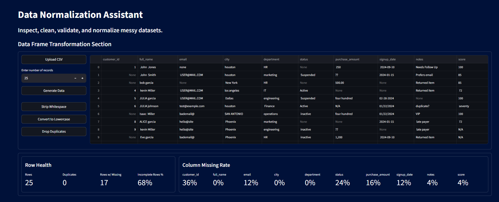
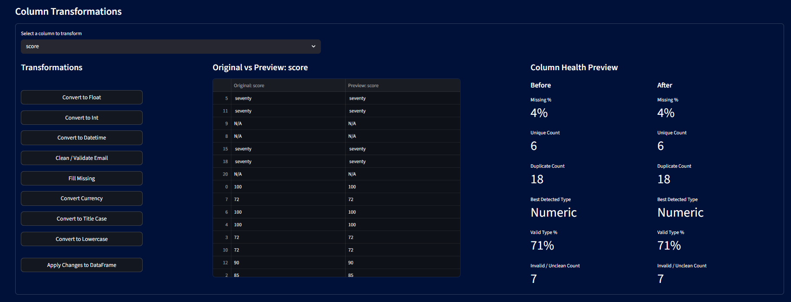
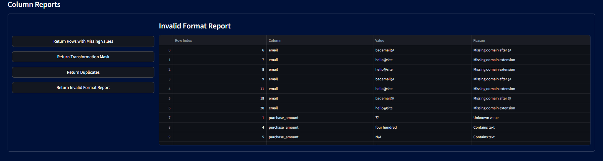
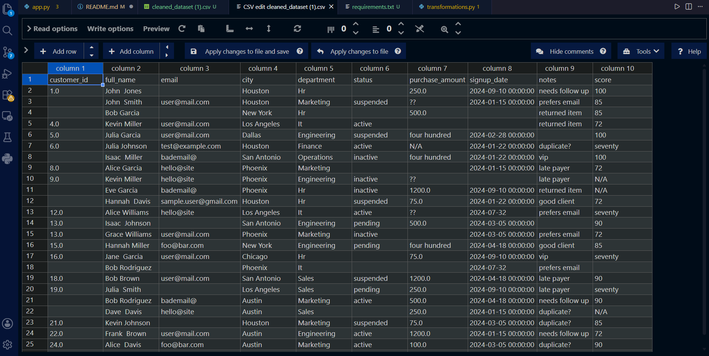

# Data Normalization Assistant

A Streamlit-based data cleaning and normalization tool designed to simulate real-world data engineering workflows.

The application allows users to upload messy datasets, inspect data quality issues, preview transformations before applying them, generate validation reports, and export reusable transformation code.

---

# Overview

Data engineers and analysts frequently work with inconsistent, incomplete, and poorly formatted datasets.

This project was built to simulate a realistic data-cleaning workflow by providing:

- Dataset health diagnostics
- Transformation previews
- Non-destructive cleaning operations
- Invalid format reporting
- Transformation tracking
- Exportable cleaning pipelines

The goal of this project is not only to clean data, but also to demonstrate practical workflow design, traceability, and reusable transformation logic.

---

# Features

## Dataset Import & Generation

- Upload CSV files
- Paste CSV text directly into the app
- Generate synthetic dirty datasets for testing

---

## Data Cleaning Transformations

### DataFrame Transformations

- Strip whitespace
- Convert text to lowercase
- Drop duplicate rows

### Column Transformations

- Convert to float
- Convert to integer
- Convert to datetime
- Convert currency values
- Clean and validate emails
- Fill missing values
- Convert to title case
- Convert to lowercase

---

## Transformation Preview System

Preview transformations before applying them to the dataset.

The preview system allows users to:

- Compare original vs transformed values
- Track cleaned values
- Identify invalid formats
- Preserve failed conversions instead of destroying data

---

## Data Health Dashboard

Built-in diagnostics provide visibility into dataset quality:

- Row count
- Duplicate count
- Rows with missing values
- Missing percentage by column
- Column-level health analysis
- Best detected column type
- Invalid / unclean value counts

---

## Transformation Mask System

The application tracks transformation states using a mask system.

Each value is categorized as:

- valid
- cleaned
- missing
- invalid format
- unprocessed

This provides traceability throughout the cleaning workflow.

---

## Invalid Format Reporting

Generate detailed invalid format reports for problematic values.

Examples include:

- Invalid emails
- Invalid dates
- Currency formatting issues
- Missing symbols
- Unrecognized patterns

---

## Transformation Code Generation

The app can generate reusable pandas transformation code based on the cleaning steps selected in the UI.

This simulates how transformation workflows may later be integrated into production ETL pipelines.

---

# Project Architecture

## app.py

Contains:

- Streamlit UI
- Workflow orchestration
- Session state handling
- User interactions
- Export controls

---

## transformations.py

Contains:

- Transformation engine
- Data diagnostics
- Validation logic
- Transformation masks
- Reporting utilities
- Code generation
- Dirty data generation

---

# Tech Stack

- Python
- Pandas
- Streamlit

---

# Screenshots

## Main Dashboard


---

## Column Transformation Preview



---

## Invalid Format Report




## Export Reports


---

# Example Workflow

1. Upload a messy CSV dataset
2. Inspect dataset health metrics
3. Select a column to transform
4. Preview transformations
5. Review invalid format reports
6. Apply changes
7. Export cleaned dataset
8. Export reusable transformation code

---

# Design Goals

This project was designed around several principles:

- Preserve failed conversions whenever possible
- Avoid destructive transformations
- Keep workflows explainable and traceable
- Simulate realistic data engineering cleaning workflows
- Separate UI logic from transformation logic
- Generate reusable transformation pipelines

---

# Future Improvements

Potential future enhancements include:

- Additional transformation types
- User-defined custom transformations
- Data normalization pipelines
- Multi-file workflow support
- Database integration
- AWS S3 integration
- Transformation history/versioning
- Automated schema detection
- Interactive visualization dashboards

---

# Running the Project

## Install Dependencies

```bash
pip install -r requirements.txt
```

## Launch Streamlit App

```bash
streamlit run app.py
```

---

# Repository Structure

```text
normalization/
│
├── app.py
├── transformations.py
├── requirements.txt
├── README.md
├── .gitignore
│
├── assets/
├── docs/
├── examples/
├── screenshots/
│
└── old_app_reference.py
```

---

# Portfolio Notes

This project was built as part of a broader effort to develop practical data engineering skills involving:

- Data cleaning
- Validation workflows
- Transformation pipelines
- Reporting systems
- Modular Python architecture
- Real-world data quality handling

The focus of the project is workflow design and practical usability rather than simple one-off scripting examples.